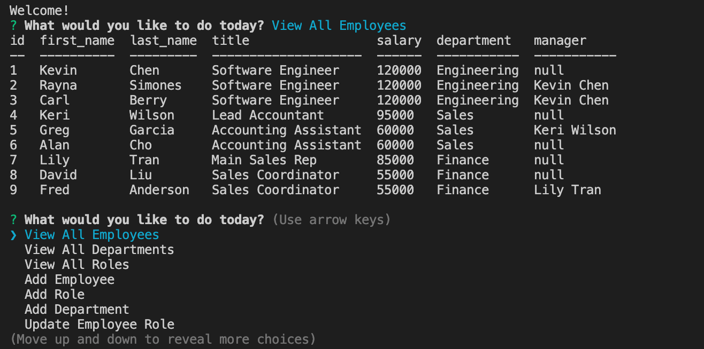

# employee-tracker

  

## Table of Contents

* [Description](#description)
* [Installation](#installation)
* [Usage](#usage)
* [Questions](#questions)

## Description

An application that allows the user to view employee data, and update employee roles.

The overall design of the project uses the following:

* `inquirer`, an NPM package for prompting questions for users
* `mysql` for utilizing methods pertaining to the MySQL database
* `node` for running application

## Installation

1. Inside Assets/sql, implement `schema.sql` and `seeds.sql` onto MySQL Workbench to set up and seed the database.
2. Please make a copy of `.env.sample`, input your own password for access to MySQL Workbench, and rename the file as .env.
3. On the Terminal, run `npm install` to install all the required dependencies.
4. Run the command `node server.js` to run the application.

## Usage

When running the app, the user has the option to view or add departments, roles or employees for a company. The information is presented in table format. The app also lets the user update an employee's role. More functionality for the application will be added in future updates.

You may also access a video demonstration of the application [here]().

## Questions

For questions or collaborations, please contact me through [GitHub](https://github.com/vxmao87).
